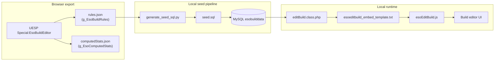

# ESO Build Editor — Project documentation

This workspace combines **forks of two UESP GitHub repositories** with **local tooling and exported game-rule data** so you can run and tweak the Elder Scrolls Online build editor stack for personal use. This document describes **what each part is** and **how data flows** between the browser, JSON exports, MySQL, PHP, and JavaScript.

For a concise runbook (goals, setup checklist, outstanding tasks), see [CHAT-HANDOFF.md](./CHAT-HANDOFF.md).

---

## 1. What lives in this workspace

| Location | Origin / role |
|----------|----------------|
| **`uesp-esochardata/`** | Fork of [uesp/uesp-esochardata](https://github.com/uesp/uesp-esochardata): PHP entry points (`testBuild.php`, `editBuild.class.php`, …), templates, and client-side build editor (`resources/esoEditBuild.js`). Also holds **local artifacts**: `rules.json`, `computedStats.json`, `generate_seed_sql.py`, `seed.sql`, and [uesp-esochardata/README.md](./uesp-esochardata/README.md). |
| **`uesp-esolog/`** | Fork of [uesp/uesp-esolog](https://github.com/uesp/uesp-esolog): shared PHP (`esoCommon.php`, CP/skill viewers, secrets layout) that production mounts as static includes. The esochardata editor **`require_once`s** these paths (today still pointing at Linux production paths in `editBuild.class.php` — you rewire for local dev). |
| **`CHAT-HANDOFF.md`** | Workspace-level handoff: architecture summary, related repos, export notes, setup checklist. |

There is **no separate application compile step** for the core editor: **PHP + MySQL + static JS/CSS** drive the UI.

---

## 2. Conceptual architecture

### 2.1 Databases (conceptual split)

| Data domain | Typical tables | Role |
|-------------|----------------|------|
| **Stat engine** | `versions`, `rules`, `effects`, `computedStats` | Defines *when* rules apply, *which buckets* they fill (`Set.*`, `Buff.*`, …), and *formulas* for each displayed stat. **Required** for a working local editor. |
| **Saved builds** | `characters`, `stats`, `skills`, `buffs`, … | Persists user builds. For solo local use you need the **schema**; you do not need UESP’s production rows. |
| **ESO Log mined data** | Large item/skill/tooltip DBs | Production often serves search/API from **`esolog.uesp.net`**. Locally you can keep calling those URLs or re-point scripts for offline use. |

### 2.2 Runtime flow (one page load)

1. **PHP** (`EsoBuildDataEditor` in `editBuild.class.php`) connects to MySQL, loads `rules`, nested `effects`, and `computedStats` for the active **rules version** (e.g. `49`), and prepares JSON for the embed template.
2. The **template** (`templates/esoeditbuild_embed_template.txt`) assigns globals the browser expects: `g_EsoBuildRules`, `g_EsoComputedStats`, `g_EsoBuildRulesVersion`, etc.
3. **JavaScript** (`resources/esoEditBuild.js`) holds **live** build state (gear, skills, buffs, CP, attributes). On change it debounces, gathers inputs, applies **rules** into intermediate buckets, evaluates each stat’s **`compute`** token list, and refreshes the UI.
4. **MySQL is not queried on every stat recalculation**; definitions are loaded once per request (or cached in your deployment). The heavy work is in the browser.

---

## 3. Local artifacts and how they relate

All paths below are under **`uesp-esochardata/`** unless noted.

### 3.1 `rules.json`

- **Source:** Live page global `g_EsoBuildRules` (DevTools → e.g. `JSON.stringify(g_EsoBuildRules, null, 2)`).
- **Contains:** Rule buckets (`buff`, `set`, `cp`, `passive`, `mundus`, `active`, enchants, `abilitydesc`, …), each rule with nested `effects[]`, plus a top-level **`stats`** object: **database-shaped** `computedStats` rows (`compute` / `dependsOn` as **strings**, as stored in MySQL).
- **Consumed by:** `generate_seed_sql.py` as the **only** file the generator reads in `main()`.

### 3.2 `computedStats.json`

- **Source:** `g_EsoComputedStats` from the same session — **in-memory UI shape** after load (e.g. `compute` as a **JS array** of tokens, `depends`, `value`, section markers like `"Basic Stats": "StartSection"`).
- **Consumed by:** Reference, diffs, or future scripts. **`generate_seed_sql.py` does not read it** (there is a `COMPUTED_STATS_FILE` constant for documentation; `main()` ignores it). If `rules.json` ever lacks a complete `stats` block, keep this export or extend the script (see CHAT-HANDOFF outstanding items).

### 3.3 `generate_seed_sql.py`

- **Input:** `rules.json` (must include `stats` for `computedStats` inserts).
- **Output:** Overwrites `seed.sql`.
- **Behavior:** Writes schema for `esobuilddata`, empty build tables, then chunked `INSERT`s for `versions`, `computedStats`, `rules`, and `effects`. Only rule types in `RULE_TYPES` are emitted; other top-level keys in `rules.json` are skipped.

### 3.4 `seed.sql`

- **Applied with:** e.g. `mysql -u root -p < uesp-esochardata/seed.sql` (from [uesp-esochardata/README.md](./uesp-esochardata/README.md)).
- **Result:** Local `esobuilddata` database ready for the PHP editor to load the same rule version you exported.

### 3.5 `uesp-esochardata/README.md`

Authoritative **artifact-focused** documentation: structure of `rules.json` / `computedStats.json`, regeneration steps, and pointers to `uesp-esolog`.

---

## 4. How the two forks interact

| Need | `uesp-esochardata` | `uesp-esolog` |
|------|-------------------|---------------|
| Build editor UI and rule DB wiring | `editBuild.class.php`, `testBuild.php`, `esoEditBuild.js`, templates | — |
| DB helpers, CP/skill data classes, secrets pattern | `require_once` (paths must be fixed locally) | `esoCommon.php`, `viewCps.class.php`, `viewSkills.class.php`, … |
| Item/skill search in browser | `testBuild.php` loads remote CSS/JS from `esobuilds.uesp.net`, `esolog.uesp.net`, wiki extensions | Hosts or mirrors many of those static endpoints in production |

Minimum for **PHP + shared libraries**: both repos cloned and **`require_once`** / secrets paths adjusted to your machine (see [CHAT-HANDOFF.md](./CHAT-HANDOFF.md) setup checklist).

Optional additional UESP repos (wiki `Special:EsoBuildEditor`, item link assets) are listed in the handoff; they are **not** required to experiment with the stat engine if you use `testBuild.php` and tolerate remote static assets.

---

## 5. Entry points and globals

- **Local test page:** `uesp-esochardata/testBuild.php` — includes `editBuild.class.php` and prints the editor HTML; still references **remote** script/style URLs unless you change them.
- **Template injection:** `g_EsoBuildRules` and `g_EsoComputedStats` are assigned in `esoeditbuild_embed_template.txt` from PHP-prepared JSON.
- **Client logic:** `esoEditBuild.js` reads those globals to run `GetEsoInputValues` / rule matching / `UpdateEsoComputedStat` cycles.

---

## 6. Refreshing rule data from live UESP

1. Open the live build editor (real browser session may be needed if automated requests hit bot protection).
2. Export `g_EsoBuildRules` → save as `uesp-esochardata/rules.json` (ensure the `stats` section is present).
3. Optionally export `g_EsoComputedStats` → `uesp-esochardata/computedStats.json`.
4. Run `python uesp-esochardata/generate_seed_sql.py` (from that directory or with correct cwd so paths resolve).
5. Re-import `seed.sql` into MySQL and confirm the editor’s rules version matches your export (e.g. `49`).

---

## 7. License and redistribution

- Upstream **`uesp-esochardata`** is MIT (see `uesp-esochardata/LICENSE`).
- Exported **`rules.json` / `computedStats.json`** are UESP-curated game-adjacent data: suitable for **personal/local** use; do not assume you may republish full dumps without checking UESP norms.

---

## 8. Quick index

| Document / file | Purpose |
|-----------------|--------|
| [CHAT-HANDOFF.md](./CHAT-HANDOFF.md) | Runbook, goals, fork list, checklist |
| [uesp-esochardata/README.md](./uesp-esochardata/README.md) | JSON + seed + generator details |
| `uesp-esochardata/generate_seed_sql.py` | `rules.json` → `seed.sql` |
| `uesp-esochardata/seed.sql` | MySQL schema + engine inserts |
| `uesp-esochardata/editBuild.class.php` | Loads DB → JSON for template |
